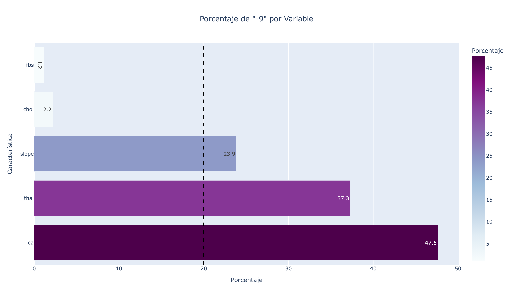
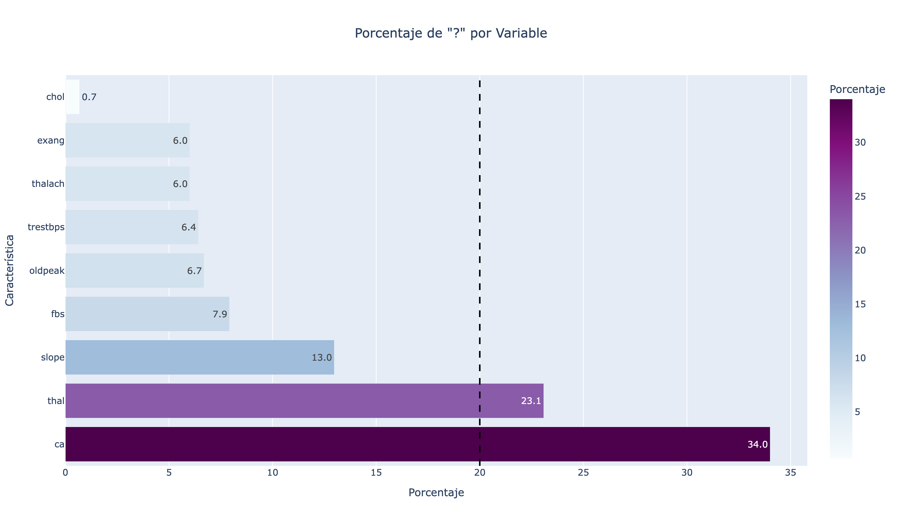
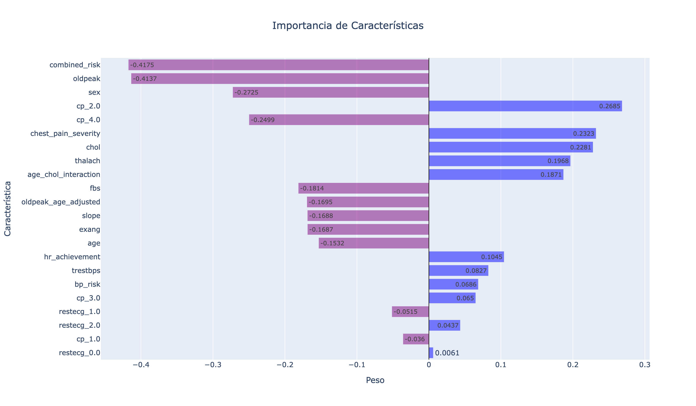
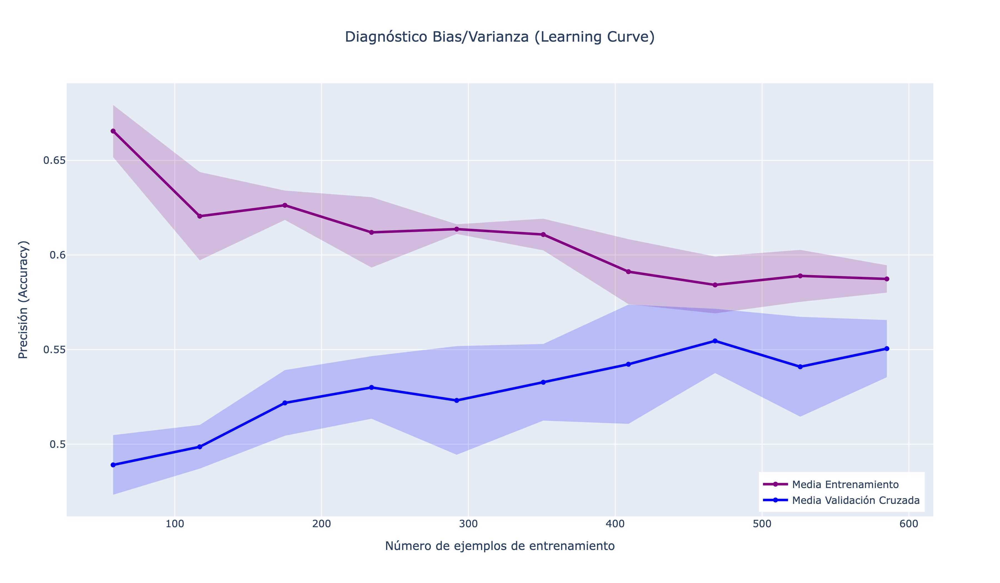

# 🫀 Predicción de Enfermedad Cardíaca: Limpieza de Datos y Feature Engineering

Hemos implementado un pipeline completo para evaluar y seleccionar la mejor estrategia de limpieza de datos e ingeniería de características. Para ello hemos seguido los siguientes pasos:

- **Gestión de valores faltantes y atípicos**: Tratamiento diferenciado para valores codificados como `-9` y `?`.
- **Ingeniería de Características**: Creación de nuevas variables sintéticas para capturar patrones de riesgo.
- **Codificación**: 
    - *Label encoder* para características categóricas con sentido ordinal.
    - *One-hot encoder* para características categóricas con sentido nominal.
- **Estandarización**: Escalado de características mediante Z-Score `StandardScaler`.
- **Modelado y Validación**:
    - Comparación de estrategias utilizando Regresión Logística como modelo base.
    - Validación cruzada estratificada `Stratified K-Fold` con 5 particiones.
    - Optimización de hiperparámetros mediante Grid Search.
- **Evaluación**: Estimación del rendimiento y estabilidad del modelo.
$$
\text{Media de la precisión} \pm \text{Desviación estándar}
$$

- **Producción**: Generación automática del archivo `submission.csv` utilizando la mejor configuración encontrada.
- **Visualizaciones**: Gráficas de la distribución de los nulos, análisis del bias/varianza y análisis de la importancia de las características.

### Resumen de Resultados

| Estrategia de Imputación `-9` | Estrategia de Imputación `?` | CV Accuracy (Train) | CV Accuracy (Test) |
| :--- | :--- | :---: | :---: |
| Mediana y Moda | Mediana y Moda | 0.5451 ± 0.026 | **0.59782** |
| Mediana y Moda | MICE | 0.5505 ± 0.014 | 0.57065 |

## Gestión de valores faltantes y atípicos

Se identificó que el dataset contenía dos tipos distintos de codificación para representar la ausencia de información: valores numéricos `-9` y caracteres de texto `?`. El análisis separado de ambos patrones revela problemas estructurales en ciertas variables clave:

- Codificación `-9`: Como se observa en el primer gráfico, esta codificación afecta severamente a tres variables que superan el umbral crítico del 20% de datos faltantes:

    - `ca`: Es la variable más comprometida, con un 47.6% de sus registros marcados como `-9`.

    - `thal`: Presenta un 37.3% de datos ausentes bajo esta codificación.

    - `slope`: Supera ligeramente el umbral con un 23.9%.

    - Variables como `chol` y `fbs` tienen una afectación mínima con menos del 3%.

- Codificación `?`: El segundo gráfico muestra que está más extendido entre las variables (afecta a 9 características), aunque con menor intensidad en la mayoría de ellas:

    - Nuevamente, `ca` con un 34.0% y `thal` con 23.1% son las únicas que superan la línea de corte del 20%.

    - Otras variables como `slope` con 13.0%, `fbs`, `oldpeak`, entre otras, presentan faltantes pero se mantienen en rangos más manejables, entre 6% y 13%.

Existe una pérdida de información sistemática en las variables ca (número de vasos mayores) y thal (thalassemia). Al combinar ambas fuentes de error, estas columnas tienen más de la mitad de sus datos comprometidos.

### Estrategias para los valores `-9`

- **Imputación simple**: Reemplazo por mediana (numéricas) y moda (categóricas).

- **Categorizar**: Tratar los `-9` como una categoría nueva, -1 (numéricas) ya que todos los valores eran positivos, y 'Otros' (categóricas). Pensamos que esto podría ayudar al modelo a identificar patrones que relacionaran la ausencia de valores en esas determinadas pruebas.

- **Valores sanos**: Reemplazarlos por valores típicos en personas sanas. Pensamos que esto podría funcionar ya que vimos que las filas con muchos `-9` estaban relacionadas con la etiqueta 0, es decir con personas sin enfermedad cardíaca.

- **Imputación avanzada**: KNN Imputer (vecinos más cercanos) y IterativeImputer (imputación iterativa). 

### Qué funcionó mejor

A pesar de que métodos avanzados como **KNN** y **MICE** mostraron métricas ligeramente superiores en la validación cruzada interna, la imputación simple **(Mediana/Moda)** demostró una capacidad de generalización superior en el conjunto de test externo (Kaggle). Esto sugiere que los métodos complejos incurrieron en **sobreajuste** *(overfitting)*, generando relaciones artificiales que no se sostenían con datos nuevos. Esto se presenta especialmente en MICE, cuyo proceso iterativo forzar relaciones inexistentes en datasets pequeños.

Por otro lado, la imputación por **'Valores Sanos'** superó a la estrategia de crear una nueva categoría numérica. Dado que la Regresión Logística es un modelo lineal, asume una relación ordinal en las variables; introducir un valor arbitrario como -1 rompe esta linealidad y puede llevar al modelo a interpretarlo erróneamente como un valor extremo o negativo, en lugar de una ausencia de dato.

En conclusión, la estrategia más robusta fue la imputación por tendencia central combinada con la eliminación de las variables `ca` y `thal`, dado que su tasa de valores nulos (>50%) introducía más incertidumbre que información.

### Estrategias para los valores `?`

- **Imputación simple**: Reemplazo por mediana (numéricas) y moda (categóricas).

- **Imputación avanzada**: KNN Imputer (vecinos más cercanos) y IterativeImputer (imputación iterativa). 

### Qué funcionó mejor

De la misma forma que anteriomente, la imputación simple resultó ganadora. La mediana y la moda, al ser estáticas, resultaron más robustas, a pesar de que en validación cruzada se deducía que la imputación avanzada funcionaba mejor.

## Ingeniería de Características

### `combined_risk`(Peso: -0.4175)
Suma +1 por cada factor de riesgo presente: Edad > 55, sexo masculino, colesterol > 240, presión arterial > 140 y angina inducida por ejercicio. Es la **variable más importante del modelo**. Al agrupar múltiples señales débiles en una sola puntuación fuerte, permitió al algoritmo identificar perfiles de alto riesgo con gran precisión. Su peso negativo indica que a mayor puntuación, mayor probabilidad de enfermedad.

### `chest_pain_severity`(Peso: +0.0.2322)
Una transformación lineal del tipo de dolor de pecho para darle un sentido de severidad ordinal. 

### `age_chol_interaction`(Peso: +0.0.1870)
Interacción entre la edad y el colesterol. Captura el riesgo biológico real: tener el colesterol alto es más peligroso cuanto mayor es el paciente. Esta variable tuvo mucho más peso que la edad por sí sola, demostrando que el contexto importa más que el dato aislado. 

### `hr_achievement`(Peso: +0.1045)
Es el porcentaje de la frecuencia cardíaca máxima teórica que el paciente logró alcanzar. Un valor bajo sugiere incapacidad para alcanzar el esfuerzo máximo esperado.

### `bp_risk`(Peso: +0.0686)
Desviación de la presión arterial ideal. Distancia absoluta de la presión del paciente respecto a 120 mmHg. Ayuda a identificar tanto hipertensión como hipotensión severa como factores de riesgo, algo que la variable lineal original no captura bien. 

### `oldpeak_adjusted`(Peso: -0.1695)
Depresión del ST ajustada por edad. Aunque útil, tuvo menos peso que la variable original.

### `chol_risk`(Peso: ~0.0000)
Bandera binaria de colesterol alto. Al simplificar un dato continuo a un simple Sí/No, se perdió información valiosa. El modelo descartó esta variable en favor de `chol`y `age_chol_interaction`.

### Pesos que no cuadran con nuestra intuición:
- `bp_risk`(Peso: +0.0686): A mayor desviación más probabilidad de no tener enfermedad. Podría estar relacionando la hipotensión con enfermedad cardíaca o simplemente está compensando la linealidad de la variable `combined_risk`.
- `chol`(Peso: +0.2280) y `age_chol_interaction`(Peso: +0.0.1870): Alto colesterol se relaciona con no tener enfermedad. Pesamos que puede deberse a que las personas enfermas toman medicación, lo que les baja colesterol. De esa forma, el colesterol alto se relaciona de forma natural con personas que no toman nada y que están sanas. O puede deberse a la linealidad con la variable `combined_risk`.
- `cp_2.0`(Peso: +0.2600), `cp_2.0`(Peso: -0.2500) y `chest_pain_severity`(Peso: +0.0.2322): Angina típica se relaciona con no tener enfermedad y dolor asintomático se relaciona con sí tener enfermedad.

### Resumen 

| Estado | Variable | Descripción / Detalle |
| :--- | :--- | :--- |
| **Original** | `age` | Edad del paciente |
| **Original** | `sex` | Sexo (0: mujer, 1: hombre) |
| **Original** | `trestbps` | Presión arterial en reposo |
| **Original** | `chol` | Colesterol sérico |
| **Original** | `fbs` | Glucosa en ayunas >120 mg/dl |
| **Original** | `restecg` | Resultado del ECG en reposo |
| **Original** | `thalach` | Frecuencia cardiaca máxima alcanzada |
| **Original** | `exang` | Angina inducida por ejercicio |
| **Original** | `oldpeak` | Depresión del ST |
| **Original** | `slope` | Pendiente del ST (ordinal) |
| **Original** | `cp` | Tipo de dolor de pecho (1, 2, 3, 4) |
| **Eliminada** | `ca` | *Motivo:* >50% valores ausentes |
| **Eliminada** | `thal` | *Motivo:* >50% valores ausentes |
| **Nueva** | `combined_risk` | Suma de factores de riesgo (edad, sexo, colest., presión, exang) |
| **Nueva** | `chest_pain_severity` | Conversión ordinal del tipo de dolor de pecho |
| **Nueva** | `age_chol_interaction`| Interacción entre edad y colesterol |
| **Nueva** | `hr_achievement` | % de frecuencia cardiaca máxima teórica alcanzada |
| **Nueva** | `bp_risk` | Distancia respecto a la presión ideal |
| **Nueva** | `oldpeak_age_adj` | Ajuste de oldpeak según edad |
| **Nueva** | `chol_risk` | Indicador binario de colesterol >240 |
| **OHE** | `cp_{1.0-4.0}` | Variables *dummy* derivadas del tipo de dolor de pecho |
| **OHE** | `restecg_{0.0-2.0}` | Variables *dummy* derivadas del resultado ECG |

## Codificación

El uso de la Regresión Logística requería entradas numéricas. La estrategia de codificación dependió de la naturaleza de cada variable categórica.

- **Label Encoder**: Se aplicó a variables binarias y ordinales. Una de sus ventajas es que mantiene la dimensionalidad baja, y además en este caso nos ayudó a preservar el orden inherente en variables donde "mayor" significa algo distinto o peor.

- **One-Hot Enconder**: Se aplicó en variables nominales como `cp`y `restecg`. El tipo de dolor de pecho 1 no es "menor" que el tipo 4; son cualitativamente distintos. De esta forma evitamos que el modelo asuma orden matemático falso que sesgaría las predicciones. 

## Estandarización

Se aplicó `StandardScaler` a todas las características de entrada antes del entrenamiento. De esta forma, transformamos los datos para que tengan una media de 0 y una desviación estándar de 1. La Regresión Logística utiliza optimizadores basados en gradientes (como `lbfgs`). Sin estandarización, variables con magnitudes grandes (como `chol` ~250) dominarían a variables pequeñas (como `oldpeak` ~2.5), haciendo que el modelo ignore estas últimas. La estandarización pone a todas las variables en igualdad de condiciones.

## Modelado y Validación

El proceso de evaluación fue diseñado para ser honesto y evitar el optimismo excesivo.

- **Regresión Logística**: Se eligió como baseline por su interpretabilidad y robustez ante datasets pequeños.

- **Stratified K-Fold (5 particiones)**:

Divide los datos en 5 partes asegurando que cada parte tenga la misma proporción de enfermos/sanos que el total. Esto es vital para evitar que un fold de validación contenga solo casos "fáciles" o solo casos de una clase, lo que daría una accuracy engañosa.

- **Grid Search**:

Automatizamos la búsqueda de los mejores hiperparámetros (`C`, `penalty`, `solver`).

Nos permitió descubrir que una regularización moderada (`C` pequeña) funcionaba mejor, confirmando que el dataset tiene mucho ruido y penalizar coeficientes altos ayuda a generalizar.

- **Métrica Final (Media ± Std)**: Una desviación estándar baja nos indicó que, aunque la accuracy no fuera estelar, el modelo era estable y confiable, no una casualidad estadística.

## Conclusiones

Observamos que el modelo sufre principalmente de **alto bias (subajuste)**. La curva de entrenamiento comienza alta pero desciende rápidamente hasta estancarse en una precisión aproximada de 0.59. Esto indica que el modelo tiene dificultades para aprender los patrones subyacentes, incluso sobre los datos que ya ha visto.

Aunque teóricamente un modelo más complejo debería elevar la curva de entrenamiento, nuestros experimentos (como veremos posteriormente) muestran que aumentar la complejidad (o relajar la regularización) no logra romper este 'techo de rendimiento'. Esto sugiere que estamos ante un caso de **error irreducible** o limitación en los datos: probablemente las variables actuales carecen de la señal suficiente para predecir mejor, especialmente tras haber eliminado características potentes como `ca` y `thal`.

Por otro lado, observamos una **baja varianza**. La brecha entre entrenamiento y validación se cierra hacia el final, lo que indica que el modelo no está memorizando (sobreajustando) los datos. Generaliza de forma consistente: su rendimiento en validación es casi idéntico al de entrenamiento.

Dado que las curvas convergen pero en un nivel bajo (planas), añadir más registros (filas) probablemente no mejoraría el modelo. El problema no es la cantidad de pacientes, sino la calidad de la información (features). La vía principal de mejora no es usar modelos más complejos, sino recuperar variables predictivas eliminadas o encontrar nuevas características que aporten información real.